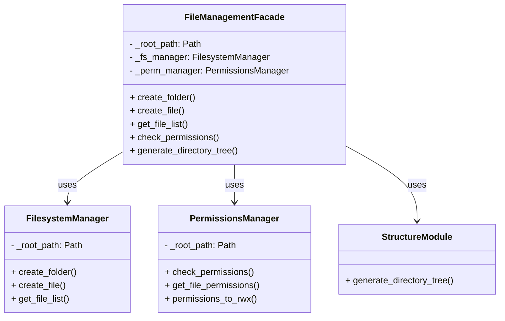

# Pathwiz

> A modern Python library for filesystem management with async support, permission handling, directory structure generation, and more.

## Overview

Pathwiz provides a high-level facade (`FileManagementFacade`) to manage files, directories, permissions, and to generate directory structures. It also supports asynchronous operations via [aiofiles](https://github.com/Tinche/aiofiles).

### UML Diagram

Below is a simplified UML diagram (image example). You can store the actual `.png` in a `docs/uml` folder, for instance:


### Mermaid Diagram

We can also embed a Mermaid class diagram:



## Installation

### 1. Install from Source

```bash
git clone https://github.com/your-username/pathwiz.git
cd pathwiz
poetry install

### 2. Install from PyPI (when published)
```python
pip install pathwiz
```
or 

```python
poetry add pathwiz
```

## Usage
Below is a simple async example using FileManagementFacade:

```python
import asyncio
from pathwiz import FileManagementFacade

async def main():
    facade = FileManagementFacade("/tmp/myproject")

    # Create folders asynchronously
    await facade.create_folder("test_folder", overwrite=True, permissions=0o755, subfolders=["sub1", "sub2"])

    # Create an empty file
    await facade.create_file("readme.txt", sub_folder="test_folder")

    # Get a list of .txt files
    txt_files = facade.get_file_list("test_folder", extension="txt")
    print("Text files:", txt_files)

    # Check and correct permissions
    await facade.check_permissions("test_folder", 0o700, resolve=True)

    # Generate directory tree (markdown and dict)
    md_tree, dict_tree = facade.generate_directory_tree("test_folder", output_format="both")
    print(md_tree)

asyncio.run(main())

```

## Project Structure
pathwiz/
├── pyproject.toml
├── setup.py
├── src/
│   └── file_management/
│       ├── __init__.py
│       ├── structure.py         # Renamed from directory.py
│       ├── exceptions.py
│       ├── manager.py           # Renamed from facade.py
│       ├── filesystem.py
│       ├── permissions.py
│       └── utils.py
├── tests/                       # Recommended folder for unit tests
└── README.md

## Contributing
Pull requests and issue reports are welcome! Feel free to open an issue or a PR on GitHub if you have any questions or suggestions.

## License
MIT License (or whichever you prefer).